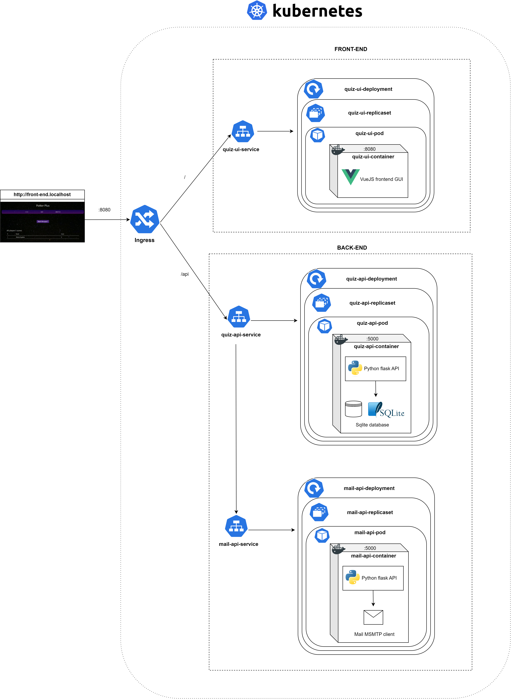

# PotterPlus

- Chaque composant (mail-api, quiz-api, quiz-api) est situé dans son propre dossier, où l'on retrouvera à la racine de chacun son propre Dockerfile.

- Le dossier yaml-kubernetes comprend les fichiers .yaml utilisés pour la configuration du cluster kuberntes.

- Le détail de ce projet est explicité dans le .pdf "Projet virtualisation.pdf" et non pas dans le README. Tout y est expliqué de A à Z, notamment l'architecture du projet, comment réaliser le build des images grâce aux Dockerfiles ainsi que l'application des commandes nécessaires afin de recréer le cluster kubernetes, etc.

# Configuration du cluster kubernetes

